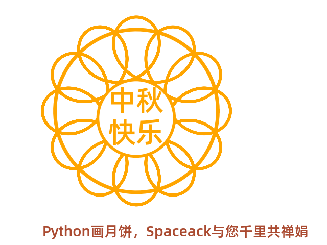
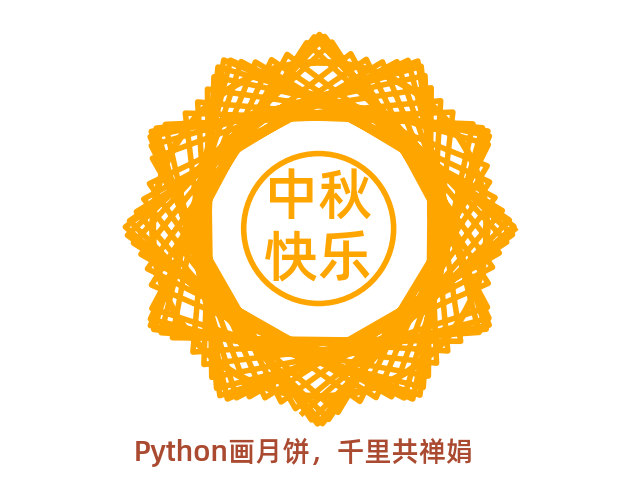
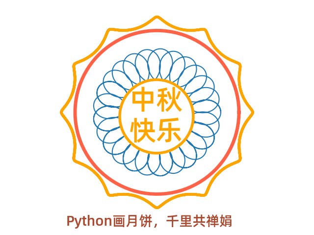
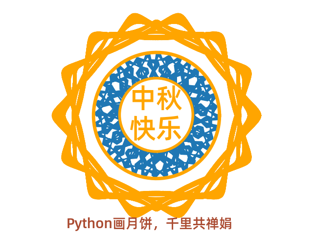
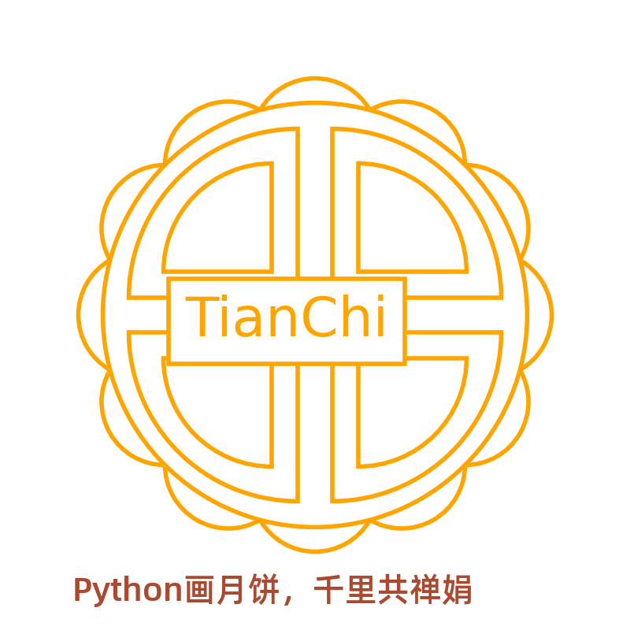

# Python画月饼，云上过中秋

今日正值中秋节，是中国民间的传统节日。中秋节自古便有祭月、赏月、吃月饼、玩花灯、赏桂花、饮桂花酒等民俗，流传至今，经久不息。

通过参加[画月饼过云上中秋](https://tianchi.aliyun.com/competition/entrance/531836/introduction?spm=5176.14154004.J_1916026360.1.16f85699DYtzG8) Python编程活动以此纪念

## Precondition
- step1: 

    `pip install -r requirements.txt`

- step2:
    
    import font 

    为了在图片上显示中文，需要先加载 Alibaba-PuHuiTi-Medium 字体

    `wget http://tianchi-media.oss-cn-beijing.aliyuncs.com/DSW/Python/miniproject/01_draw_moon_cake/Alibaba-PuHuiTi-Medium.ttf`

## 绘制原理

利用数学解析几何中的内旋轮线（hypotrochoid），内旋轮线是追踪附着在围绕半径为 R 的固定的圆内侧滚转的半径为 r 的圆上的一个点得到的转迹线，这个点到内部滚动的圆的中心的距离是d。

繁花曲线规（万花尺，万花规）也是应用之一，大小齿轮的齿数之比，约为最简分数时，其分母就是小齿轮的自转数，分母与分子之和就是图案中的花瓣数。而分子就是小齿轮沿着大齿轮的公转数。所以，只要掌握这个最简分数，就能知道画出来的图案大概是什么形状的。总而言之，选择不同的齿轮与不同的孔，就可画出细腻、动人的各种曲线，例如玫瑰线、内摆线等等。

理论上通过玄学调参可以生成无数种图形可能。 示例如下：

## Perview

- basic moon cake

 
- magic moon cake

- flower moon cake

- sun moon cake

- sunflower moon cake

- crescent moon cake

- velvet moon cake

